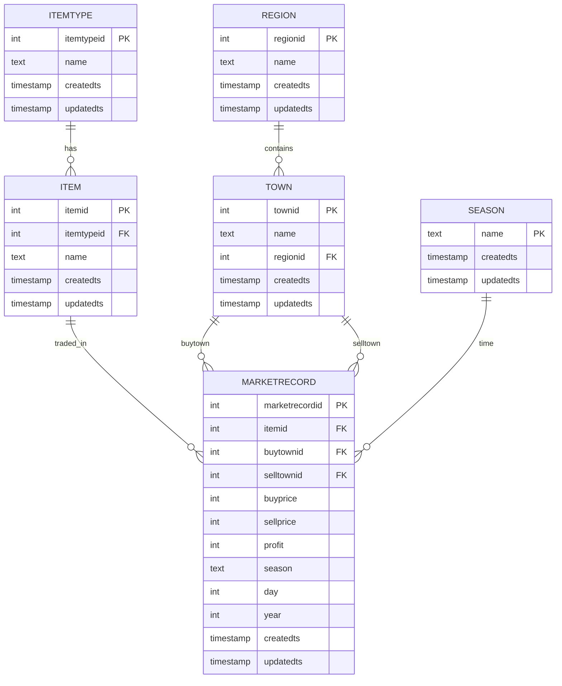

# bannerlord-merchant-routes


A helping tool for the merchants of Mount &amp; Blade II: Bannerlord

## 🏃 Start
- Create the database following the provided graph. Consistent data are provided in public folder.
- Create a .env following the provided .env.example format
- Install dependency:
```
pip install -r requirements.txt
```
- Run:
```
python -m src.main
```

## 🚀 Features

1. **Record Market Trades**
   - Capture item trades with buy/sell towns, prices, auto-calculated profit, in-game date time

2. **Search & Filter Records**
   - View all records or filter by town/item sorted by profit and in-game date time

3. **Delete A Market Record**
   - Select record to delete

4. **Dynamic Data Entry**
   - Create new items and item types seamlessly during workflows

## 📚 Data Model

